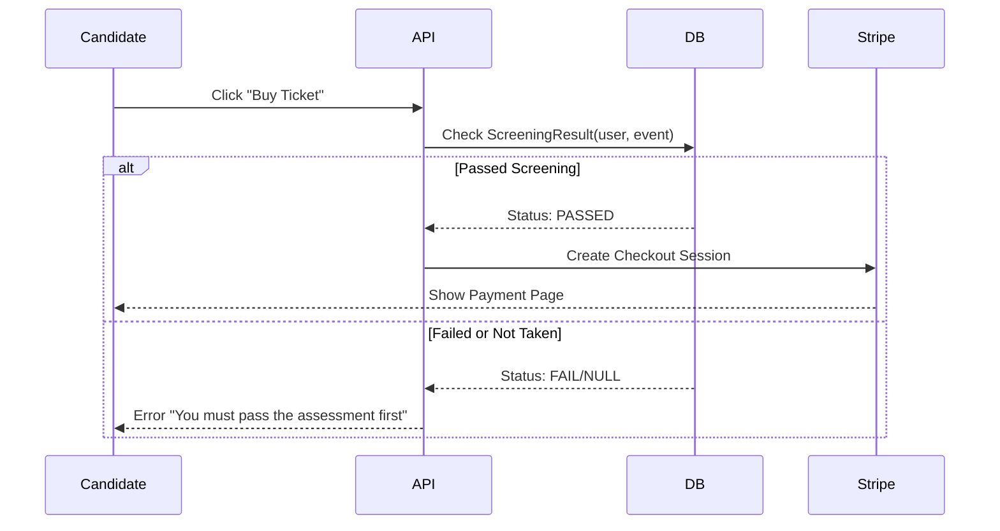

# QuietHR Implementation Plan

## 1. System Architecture

### Tech Stack Recommendation
*   **Frontend**: Next.js 14+ (App Router), TypeScript, Tailwind CSS, Shadcn UI.
*   **Backend**: Next.js Server Actions & API Routes (Node.js runtime).
*   **Database**: PostgreSQL (managed via Supabase or Neon), accessed via **Prisma ORM**.
*   **Authentication**: NextAuth.js (v5) or Clerk.
*   **Media Storage**: AWS S3 (or compatible object storage like Cloudflare R2) for portfolio images/videos.
*   **Payments**: Stripe (Checkout & Connect).
*   **AI/LLM Engine**: OpenAI API (GPT-4o) or Anthropic (Claude 3.5 Sonnet) for sentiment analysis and portfolio grading.
*   **Real-time**: Pusher or Supabase Realtime for live event chat and rapid updates.

### Architecture Diagram (Logical)
```mermaid
graph TD
    Client[Client: Next.js App]
    Auth[Auth Service]
    API[Next.js API Routes]
    DB[(PostgreSQL)]
    Storage[Object Storage (S3)]
    AI[AI Analysis Service]
    Pay[Stripe Payment Gateway]

    Client --> Auth
    Client --> API
    API --> DB
    API --> Pay
    
    %% Portfolio Upload Flow
    Client -->|Direct Upload| Storage
    Client -->|Metadata| API
    API -->|Trigger Analysis| AI
    AI -->|Update Score| DB
    
    %% Recruitment Flow
    API -->|Fetch Ranked Candidates| Client
```

### The "Gauntlet" Flow (Screening to Payment)


### Media & AI Pipeline
1.  **Upload**: Client requests presigned URL -> Uploads file to S3 -> Returns key to API.
2.  **Ingestion**: API creates `PortfolioItem` record.
3.  **Analysis (Async)**: 
    *   **Link Checker**: Pings external URLs (GitHub/Behance) to verify status (200 OK).
    *   **Content Scan**: LLM analyzes title/description + validates "Tech/Coding" relevance using video transcript/metadata.
    *   **Scoring**: Updates `engagement_signals` and `candidate_scores`.

---

## 2. Implementation Steps

### Phase 1: Foundation & Identity (Profile/Portfolio)
*   **Goal**: Users can sign up, build a rich profile, and upload portfolio items that get analyzed.
*   **Tasks**:
    1.  Setup Next.js repo with Prisma & Postgres.
    2.  Implement Authentication (Recruiter vs Candidate roles).
    3.  Create `Profile` CRUD: Bio, Social Links.
    4.  Create `Portfolio` System:
        *   S3 Upload integration.
        *   `PortfolioItem` creation.
        *   Background job for "AI Portfolio Boost" (Mock AI initially, then integrate LLM).
    5.  Build Candidate Dashboard to view own stats.

### Phase 2: Events & The Gate (Meritocratic Paywall)
*   **Goal**: Recruiters create events; Candidates take assessments to unlock payment.
*   **Tasks**:
    1.  Create `Event` and `PreScreening` models.
    2.  Build the **Pre-Screener Interface** (Gamified form/quiz).
    3.  Implement **The Gate Logic**:
        *   Server Action to grade assessment.
        *   Conditional logic: If `passed` -> Generate Stripe Checkout Session.
    4.  Stripe Webhook handler to update `Ticket` status to `paid`.

### Phase 3: AI Monetization & Shop
*   **Goal**: Recruiters browse ranked talent; AI generates composite scores.
*   **Tasks**:
    1.  Implement **Scoring Engine**:
        *   Composite Score calculation triggers.
        *   Privacy Gate check (`privacy_consent`).
    2.  Build **Talent Shop**:
        *   Grid view with filters ("Rich Portfolio", "Top 1%").
        *   "Unlock Candidate" monetization flow.
    3.  Develop Live Event Interface (Video placeholder + Chat).

---

## 3. Detailed Database Schema (Prisma)

```prisma
// schema.prisma

datasource db {
  provider = "postgresql"
  url      = env("DATABASE_URL")
}

generator client {
  provider = "prisma-client-js"
}

enum UserRole {
  CANDIDATE
  RECRUITER
  ADMIN
}

enum PaymentStatus {
  PENDING
  PAID
  FAILED
}

model User {
  id              String    @id @default(cuid())
  email           String    @unique
  role            UserRole  @default(CANDIDATE)
  wallet_balance  Decimal   @default(0.0)
  privacy_consent Boolean   @default(false)
  createdAt       DateTime  @default(now())
  
  // New Fields
  stripe_connect_id String?   // The Recruiter's payout account ID
  is_consultancy    Boolean   @default(false) // Differentiates In-house vs Agency

  // Relations
  profile         Profile?
  portfolioItems  PortfolioItem[]
  tickets         Ticket[]
  screeningResults ScreeningResult[]
  candidateScores CandidateScore[]
  eventsOwned     Event[]   @relation("EventOwner")
  messages        EventMessage[]
}

model Profile {
  id              String  @id @default(cuid())
  userId          String  @unique
  user            User    @relation(fields: [userId], references: [id])
  headline        String?
  bio             String? @db.Text
  video_intro_url String?
  social_links    Json?   // Structure: { github: string, linkedin: string, website: string }
  tech_stack      String[] // Array of tags e.g. ["React", "Python"]
}

model PortfolioItem {
  id            String   @id @default(cuid())
  userId        String
  user          User     @relation(fields: [userId], references: [id])
  title         String
  description   String?  @db.Text
  media_url     String?  // S3 URL for video/image
  external_link String?  // GitHub, App Store
  tags          String[]
  
  // AI Analysis Metadata
  is_verified_link Boolean @default(false)
  ai_quality_score Float   @default(0.0) // 0-10 scale based on AI analysis
  
  createdAt     DateTime @default(now())
}

model Event {
  id               String   @id @default(cuid())
  ownerId          String
  owner            User     @relation("EventOwner", fields: [ownerId], references: [id])
  topic            String
  description      String?
  start_time       DateTime
  ticket_price     Decimal
  
  // The Gate
  pre_screening_id String?  @unique // Link to assessment config
  pass_threshold   Int      @default(70) // Score needed to unlock payment
  
  tickets          Ticket[]
  screeningResults ScreeningResult[]
  messages         EventMessage[]
}

model ScreeningResult {
  id        String   @id @default(cuid())
  userId    String
  user      User     @relation(fields: [userId], references: [id])
  eventId   String
  event     Event    @relation(fields: [eventId], references: [id])
  
  score     Int      // 0-100
  passed    Boolean
  completedAt DateTime @default(now())
  
  @@unique([userId, eventId]) // One attempt per event (or handle retries logic)
}

model Ticket {
  id             String        @id @default(cuid())
  userId         String
  user           User          @relation(fields: [userId], references: [id])
  eventId        String
  event          Event         @relation(fields: [eventId], references: [id])
  payment_status PaymentStatus @default(PENDING)
  payment_intent String?       // Stripe ID
  
  purchasedAt    DateTime      @default(now())
  
  @@unique([userId, eventId])
}

model CandidateScore {
  id                String @id @default(cuid())
  userId            String
  user              User   @relation(fields: [userId], references: [id])
  eventId           String // Contextual score per event/job
  
  pre_screen_score  Float
  portfolio_quality Float
  live_quiz_score   Float
  sentiment_score   Float
  ai_interview      Float
  
  composite_score   Float  // Calculated total
  
  updatedAt         DateTime @updatedAt
  
  @@unique([userId, eventId])
}

model EventMessage {
  id        String   @id @default(cuid())
  eventId   String
  userId    String
  content   String   @db.Text
  createdAt DateTime @default(now())

  event     Event    @relation(fields: [eventId], references: [id])
  user      User     @relation(fields: [userId], references: [id])

  // Indexes for fast retrieval during AI analysis
  @@index([eventId])
}
```

---

## 4. API Route Structure

### Authentication & User
*   `POST /api/auth/register`: Create user.
*   `POST /api/auth/login`: Session handling.
*   `GET /api/user/me`: Current user context.

### Profile & Portfolio
*   `GET /api/profile/[userId]`: Fetch public profile.
*   `POST /api/profile/update`: Update bio, socials, tech stack.
*   `POST /api/portfolio/add`: Create item, trigger AI analysis background job.
*   `DELETE /api/portfolio/[itemId]`: Remove item.
*   `GET /api/upload/presigned-url`: Generate S3 upload URL.

### Events & The Gate
*   `GET /api/events`: List available events.
*   `GET /api/events/[id]`: Event details + check if user passed screening.
*   `POST /api/assessment/submit-prescreen`: Submit answers -> Grade -> Return Pass/Fail.
*   `GET /api/assessment/status`: Check if user is allowed to pay.

### Payments
*   `POST /api/payment/checkout`: Create Stripe Session (Requires passing assessment).
*   `POST /api/webhook/stripe`: Listen for success -> Update Ticket.

### Recruitment Shop
*   `GET /api/shop/candidates`: Returns ranked list. 
    *   *Params*: `min_score`, `has_portfolio`, `event_id`.
    *   *Response*: Includes thumbnails, badges ("Builder", "Top 1%").
*   `POST /api/shop/unlock`: Transaction to reveal full candidate contact info.

---

## 5. Core Component Hierarchy

### Shared
*   `Navbar`: Role-aware (Recruiter vs Candidate).
*   `Footer`.
*   `AuthGuard`: Higher-order component for route protection.

### Candidate Views
*   `DashboardLayout`
    *   `StatsCard` (Tickets, Scores).
    *   `UpcomingEventsList`.
*   `ProfileEditor`
    *   `BioForm`.
    *   `SocialsInput`.
    *   `PortfolioManager`.
        *   `UploadZone` (Drag & drop).
        *   `PortfolioGrid` -> `PortfolioCard`.
*   `EventDiscovery`
    *   `EventCard` (Price, Topic).
*   `TheGauntlet` (Assessment)
    *   `QuizInterface`.
    *   `Timer`.
    *   `ResultModal` (Pass -> Show "Pay Now" | Fail -> Show "Retry Later").

### Recruiter Views
*   `RecruiterDashboard`
    *   `RevenueChart`.
    *   `ActiveHoneyPots` (List of managed events).
*   `TalentShop`
    *   `FilterSidebar` (Skills, Score Thresholds).
    *   `CandidateGrid`.
        *   `CandidateCard` (Anonymized initially).
        *   `UnlockButton`.
*   `EventCreator`
    *   `BasicInfoForm`.
    *   `GateConfigurator` (Set quiz difficulty, Price).
    *   `SuccessCriteriaBuilder` (Weights for AI).
